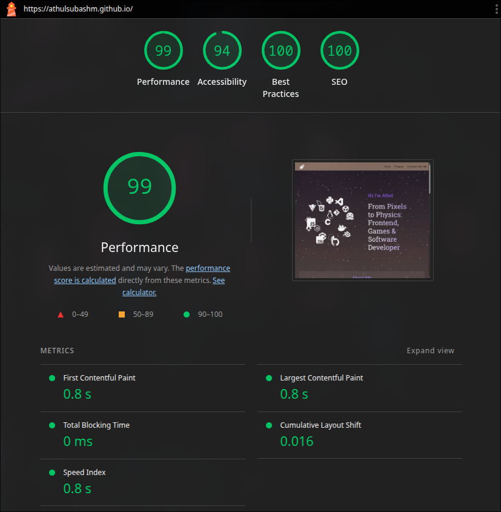

# Athul Subash - Portfolio

Welcome to my personal portfolio website! This project showcases my skills, projects, and experience as a developer. It's built with modern web technologies to ensure performance, responsiveness, and a great user experience.

## Features

- **Interactive 3D Elements**: A dynamic 3D icon sphere in the hero section using Three.js.
- **Project Showcase**: A slider and grid view to display my projects with details and links.
- **Tech Stack Visualization**: A categorized display of my technical skills.
- **Responsive Design**: Fully optimized for all device sizes using grids, clamps and media queries 
- **Glassmorphism UI**: A modern, sleek aesthetic with blurred backgrounds and subtle animations.

## Tech Stack

- **Framework**: [Astro](https://astro.build/)
- **Styling**: CSS3 (Custom Properties, Flexbox, Grid)
- **3D Graphics**: [Three.js](https://threejs.org/)
- **Icons**: [Simple Icons](https://simpleicons.org/)
- **Deployment**: GitHub Pages

## Getting Started

To run this project locally, follow these steps:

1.  **Clone the repository:**

    ```bash
    git clone https://github.com/AthulSubashM/athulsubashm.github.io.git
    cd athulsubashm.github.io
    ```

2.  **Install dependencies:**

    ```bash
    npm install
    ```

3.  **Start the development server:**

    ```bash
    npm run dev
    ```

4.  **Build for production:**
    ```bash
    npm run build
    ```

## Lighthouse Performance



## Connect

Feel free to reach out to me!

- [Email](mailto:athul.m.subash@gmail.com)
- [LinkedIn](https://www.linkedin.com/in/athulmsubash/)
- [GitHub](https://github.com/AthulSubashM)
- [Instagram](https://www.instagram.com/athulxo/)

---

© 2025 Athul Subash Marottikkal. All rights reserved.
